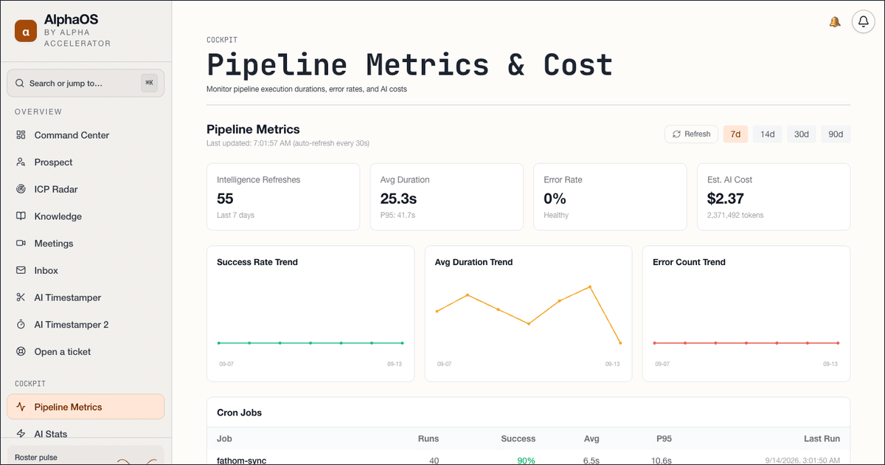
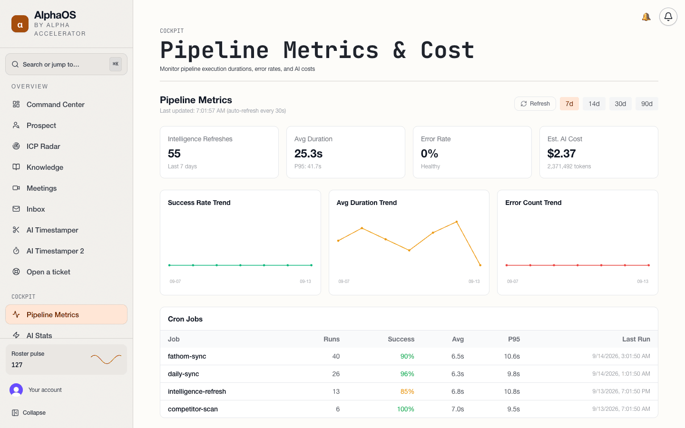
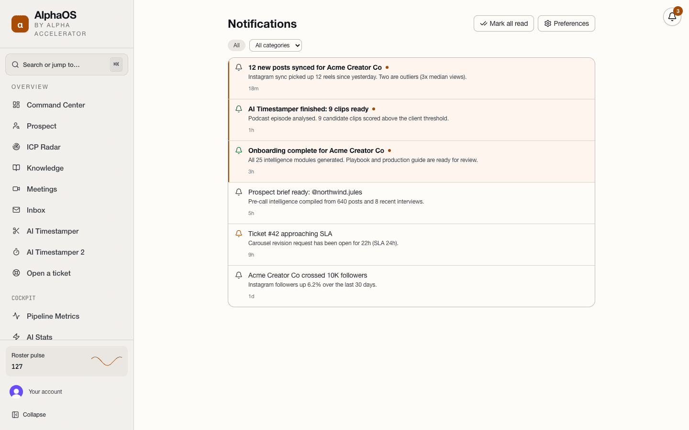
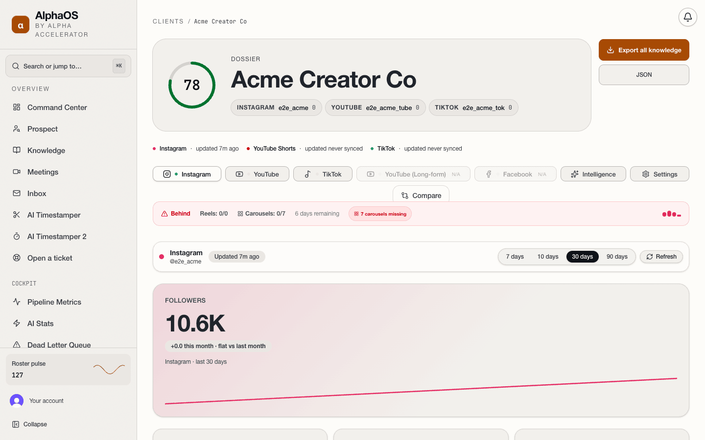
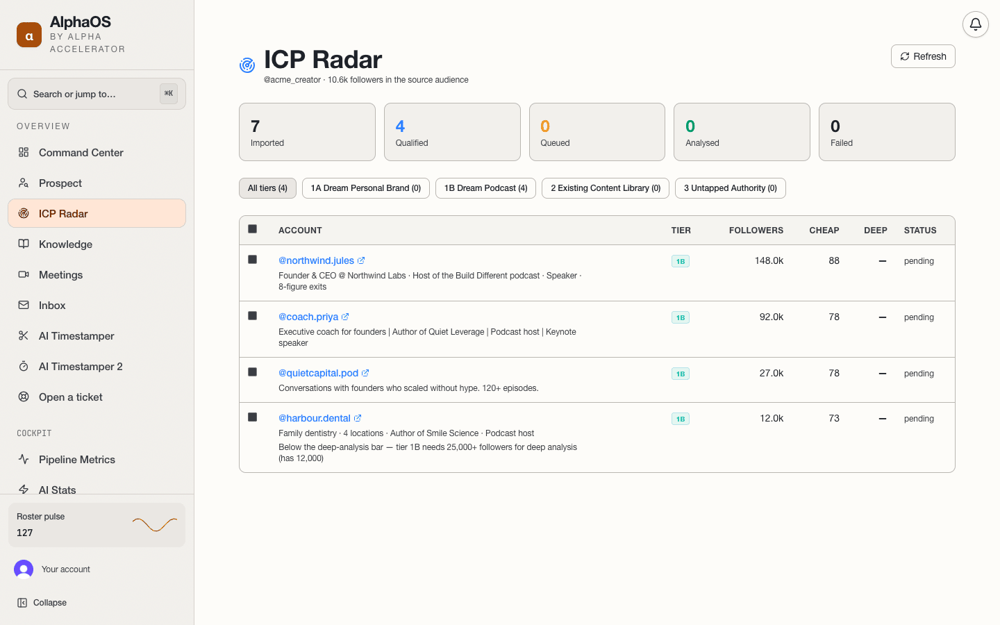
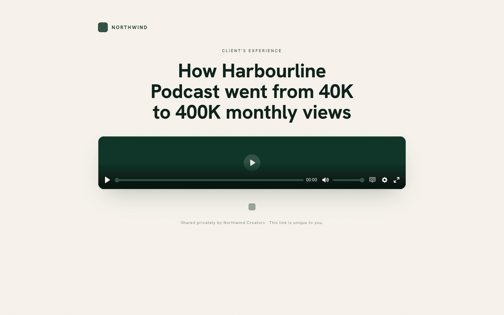
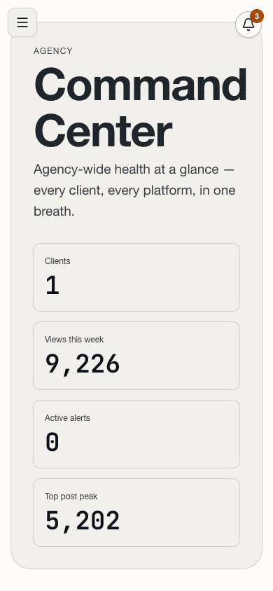
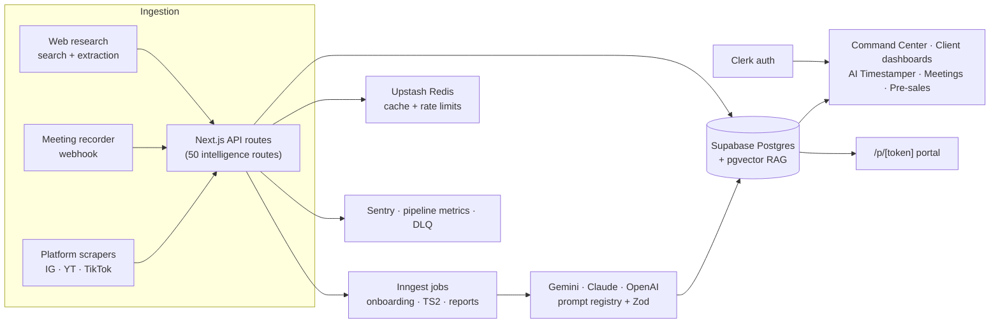

**[← All 14 systems](https://github.com/FakharEAli/portfolio)** · [VerticalVoice](https://github.com/FakharEAli/verticalvoice-ai-receptionist) · [SeatWise](https://github.com/FakharEAli/seatwise-enrolment-agent) · [CohortPilot](https://github.com/FakharEAli/cohortpilot-admissions-ai)

# AlphaOS

**The operating system for a premium content agency: every client's analytics, every podcast's best clips, every meeting's decisions, in one place.**

🟢 **In production** · **Client:** Alpha Accelerator, a premium content agency · **Live:** private deployment

## The problem

A content agency managing high-profile creators across Instagram, YouTube and TikTok runs on fragmented data. Metrics live in three native analytics tools. Timestampers manually scrub 60-minute podcasts for the best 60-second clips. Editors lack client-specific rules. Meeting decisions evaporate. Strategy is reactive, not proactive. Every one of these was a person doing by hand what software should do.

## What I built

- **Command Center**: agency home with hero KPI cards (total clients, views this week, active alerts, top post), an onboarding pipeline grid with progress bars, and a "needs attention" list of at-risk clients, sorted by health score.
- **Client dashboards** with a multi-tab layout per platform (Instagram / YouTube / TikTok) plus Intelligence and Settings, platform comparison mode, customisable tab names and cross-platform metric normalisation.
- **25 AI intelligence modules** behind a versioned prompt registry with Zod schemas: hook scoring, content and audience analysis, Content DNA profiles, caption scoring, posting cadence with a heatmap and holiday calendar, competitor discovery (7-dimension scoring), trend detection, Script Factory, Monday Reports, Playbooks and production guides.
- **AI Timestamper (TS2)**: long-form episode in, ranked clip candidates out. A two-phase Scene Spotter + Critic pipeline scores 80 to 120 candidates per video on emotion, story value, clarity, energy and shareability, then returns timestamps, rewritten hooks and editor instructions. Backed by a frozen, human-labelled ground-truth benchmark of 1,259 moments across 179 videos with recall, surfaced-recall and hook-match reporting.
- **Transcript & video portal** at `/p/[token]`: signed, shareable per-item pages for reviewers and editors.
- **Pre-sales engine**: prospect analysis (6-stage pipeline: profile → posts → web → classification → golden video → brief), ICP radar with candidate import and queue, proof-asset and case-study campaigns with tracked events.
- **Meeting knowledge**: meeting transcripts synced from the recorder, deep analysis (executive summary, decisions, action items, key quotes), and a pgvector RAG knowledge base with universal and per-client scopes.
- **Operations layer**: 6-phase automated client onboarding (analytics → transcription → web research → DNA → competitors → playbook, about 15 minutes), notifications and inbox, tickets, and admin pages for AI stats, pipeline metrics, dead-letter queue and feature flags.
- **Infrastructure**: Clerk auth, Sentry, multi-layer caching, rate limiting and circuit breakers, Inngest background jobs, webhooks for ingestion, Playwright end-to-end checks.

## Screenshots

Admin cockpit: pipeline metrics across the agency's client roster

<table>
  <tr>
    <td width="50%" valign="top"> Notification centre: alerts from analytics, publishing and meetings</td>
    <td width="50%" valign="top"> Per-client cross-platform analytics with retention and reach breakdowns</td>
  </tr>
  <tr>
    <td width="50%" valign="top"> ICP Radar: prospect qualification by tier with cheap and deep analysis scores</td>
    <td width="50%" valign="top"> Client-facing public portal with the shareable report view</td>
  </tr>
  <tr>
    <td colspan="2" align="center"> Mobile: command center</td>
  </tr>
</table>

## Architecture

## Stack

## My role

Architect and lead engineer from the first commit. I built the data ingestion, the intelligence modules and their prompt registry, the TS2 clip pipeline and its ground-truth benchmark harness, the onboarding pipeline, the pre-sales tooling and the infrastructure layer. The agency's lead strategist and ops team are the daily users.

## Outcomes

- 71 catalogued features (57 user-facing + 14 infrastructure), each audited and rated for maturity.
- Client onboarding that used to be manual now runs as a 6-phase pipeline in about 15 minutes.
- Clip selection moved from manual scrubbing to a scored, benchmarked extractor; the benchmark harness gives an honest recall number (baseline 52.4% on the covered subset) instead of a vibe.
- One system replaced scattered analytics tools, Notion pages and spreadsheets as the agency's daily operating surface.

## Status & timeline

Repo created 2026-05-06 · last push 2026-09-13 · 🟢 In production, actively developed.

---
Part of the <a href="https://github.com/FakharEAli/portfolio">FakharEAli portfolio</a> — real systems, anonymized seeded data, source available under NDA. © 2026 Fakhar E Ali · CC BY-NC-ND 4.0
